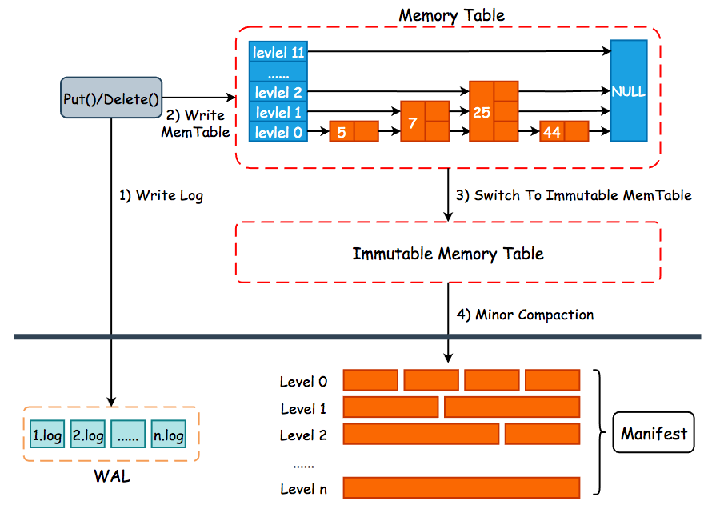
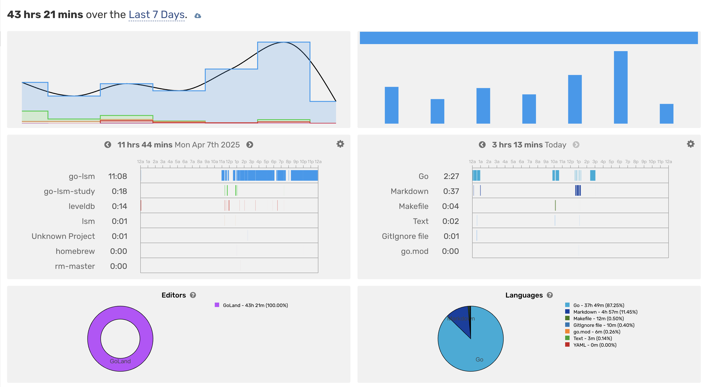

# go-lsm

`go-lsm` is a simple LSM tree implementation in Go.

## References

- [mini-lsm](https://skyzh.github.io/mini-lsm/)
- [whuanle/lsm](https://www.cnblogs.com/whuanle/p/16297025.html)
- [go-lsm](https://github.com/SarthakMakhija/go-lsm)
- [reading-source-code-of-leveldb-1.23](https://github.com/SmartKeyerror/reading-source-code-of-leveldb-1.23)
- [leveldb](https://github.com/merlin82/leveldb)

## Design

In the implementation of LSM-Tree (Log-Structured Merge-Tree), a common design pattern is to utilize SkipList-based MemTable (In-Memory Table) and SSTable (Sorted String Table). This architecture is widely adopted in popular LSM-Tree-based databases like LevelDB and RocksDB.



You can refer to [description](./docs/description.md)

## Log

- Day 1
  - KV structure
  - SkipList
- Day 2
  - Memtable and IMemtable
  - WAL
- Day 3 - Day 6
  - SSTable
  - Memtable Builder
  - SSTable Manager
- Day 7
  - Compaction
  - Test



## Article

> These docs are derived from and modified based on [reading-source-code-of-leveldb-1.23](https://github.com/SmartKeyerror/reading-source-code-of-leveldb-1.23) under BSD-3-Clause license.

- [KV](kv/README.md)
- [Memtable](memory/README.md)
- [WAL](wal/README.md)
- [SSTable](disk/README.md)

## Benchmark

```bash
make bench
```

```text
goos: darwin
goarch: arm64
pkg: github.com/xmh1011/go-lsm/database
cpu: Apple M1 Pro
BenchmarkPut-8           2705047             27965 ns/op
BenchmarkGet-8           141958136           248.0 ns/op
BenchmarkDelete-8        1000000             33963 ns/op
PASS
ok      github.com/xmh1011/go-lsm/database      196.498s
```

```bash
make benchmark
```

```text
==============================================
 测试目录   : /Users/xiaominghao/code/go-lsm/data
 写入数量   : 2000000
 写入耗时   : 56.3379755s
 写 ops/s  : 35500.03
 写 ns/op  : 28168.99
 读取数量   : 1000
 读取耗时   : 6m28.036797333s
 读 ops/s  : 2.58
 读 ns/op  : 388036797.33
==============================================
```

## Data Directory

```text
[ 128]  data
├── [ 288]  sstable
│   ├── [ 192]  0-level
│   │   ├── [1.7M]  134.sst
│   │   ├── [1.7M]  135.sst
│   │   ├── [1.7M]  136.sst
│   │   └── [1.7M]  137.sst
│   ├── [ 320]  1-level
│   │   ├── [1.7M]  115.sst
│   │   ├── [1.7M]  116.sst
│   │   ├── [1.7M]  117.sst
│   │   ├── [1.7M]  118.sst
│   │   ├── [1.7M]  119.sst
│   │   ├── [1.7M]  85.sst
│   │   ├── [1.7M]  86.sst
│   │   └── [1.7M]  87.sst
│   ├── [ 576]  2-level
│   │   ├── [1.7M]  100.sst
│   │   ├── [1.7M]  101.sst
│   │   ├── [1.7M]  102.sst
│   │   ├── [1.7M]  103.sst
│   │   ├── [1.7M]  104.sst
│   │   ├── [1.7M]  125.sst
│   │   ├── [1.7M]  126.sst
│   │   ├── [1.7M]  127.sst
│   │   ├── [1.7M]  128.sst
│   │   ├── [1.7M]  129.sst
│   │   ├── [1.7M]  94.sst
│   │   ├── [1.7M]  95.sst
│   │   ├── [1.7M]  96.sst
│   │   ├── [1.7M]  97.sst
│   │   ├── [1.7M]  98.sst
│   │   └── [1.7M]  99.sst
│   ├── [  96]  3-level
│   │   └── [1.7M]  132.sst
│   ├── [  64]  4-level
│   ├── [  64]  5-level
│   └── [  64]  6-level
└── [ 416]  wal
    ├── [1.6M]  29.wal
    ├── [1.6M]  30.wal
    ├── [1.6M]  31.wal
    ├── [1.6M]  32.wal
    ├── [1.6M]  33.wal
    ├── [1.6M]  34.wal
    ├── [1.6M]  35.wal
    ├── [1.6M]  36.wal
    ├── [1.6M]  37.wal
    ├── [1.6M]  38.wal
    └── [1.5M]  39.wal
```

## TODO List

- Performance Optimization
- Tombstone
- MVCC
- Snapshot
- 2 PL
- Data Block Compression