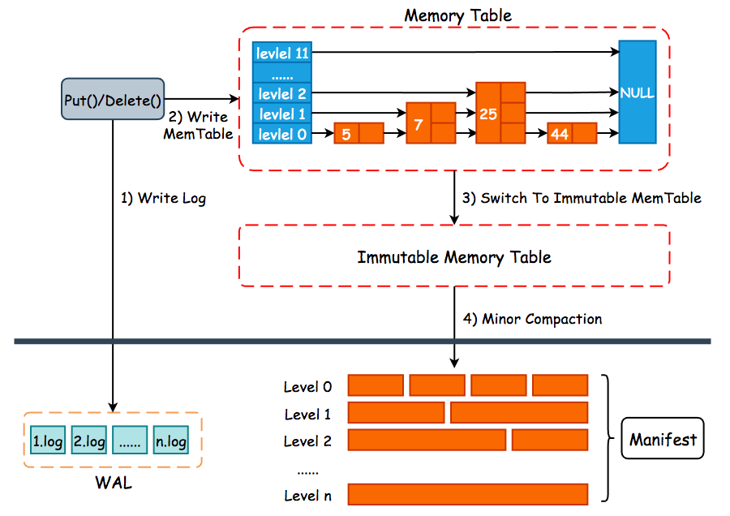
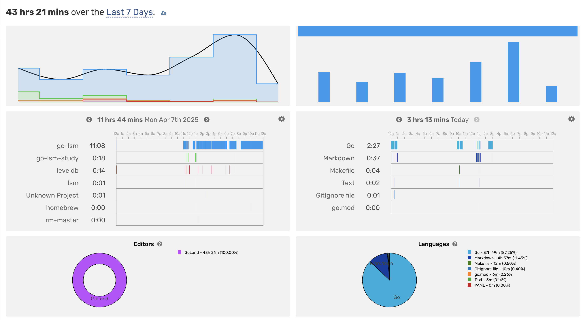

# go-lsm

`go-lsm` is a simple LSM tree implementation in Go.

## References

- [mini-lsm](https://skyzh.github.io/mini-lsm/)
- [go-lsm](https://github.com/SarthakMakhija/go-lsm)
- [reading-source-code-of-leveldb-1.23](https://github.com/SmartKeyerror/reading-source-code-of-leveldb-1.23)
- [leveldb](https://github.com/merlin82/leveldb)
- 美 彼得罗夫 Petrov, Alex.数据库系统内幕[M].机械工业出版社,2020.

## Design

In the implementation of LSM-Tree (Log-Structured Merge-Tree), a common design pattern is to utilize SkipList-based MemTable (In-Memory Table) and SSTable (Sorted String Table). This architecture is widely adopted in popular LSM-Tree-based databases like LevelDB and RocksDB.



You can refer to [description](./docs/description.md)

## Log

- Day 1
  - KV structure
  - SkipList
- Day 2
  - Memtable and IMemtable
  - WAL
- Day 3 - Day 6
  - SSTable
  - Memtable Builder
  - SSTable Manager
- Day 7
  - Compaction
  - Test



## Article

> These docs are derived from and modified based on [reading-source-code-of-leveldb-1.23](https://github.com/SmartKeyerror/reading-source-code-of-leveldb-1.23) under BSD-3-Clause license.

- [KV](kv/README.md)
- [Memtable](memtable/README.md)
- [WAL](wal/README.md)
- [SSTable](sstable/README.md)

## Benchmark

```bash
make bench
```

```text
goos: darwin
goarch: arm64
pkg: github.com/xmh1011/go-lsm/database
cpu: Apple M1 Pro
BenchmarkPut-8           2679295             27066 ns/op
BenchmarkGet-8           135709042           245.1 ns/op
BenchmarkDelete-8        1000000             34749 ns/op
PASS
ok      github.com/xmh1011/go-lsm/database      194.531s
```

```bash
make benchmark
```

```text
==============================================
 测试目录   : /Users/xiaominghao/code/go-lsm/data
 循环轮数   : 5
 写入总数   : 5000000
 写入耗时   : 1m11.386123716s (平均)
 写 ops/s  : 14008.32 (平均)
 写 ns/op  : 71386.12 (平均)
 读取总数   : 5000
 读取耗时   : 14.846059766s (平均)
 读 ops/s  : 67.36 (平均)
 读 ns/op  : 14846059.77 (平均)
================================================
```

## Data Directory

```text
➜  go-lsm git:(dev) ✗ tree -h -L 3 data
[ 128]  data
├── [ 288]  sstable
│   ├── [ 128]  0-level
│   │   ├── [1.8M]  866.sst
│   │   └── [1.8M]  871.sst
│   ├── [ 320]  1-level
│   │   ├── [1.8M]  814.sst
│   │   ├── [1.8M]  858.sst
│   │   ├── [1.8M]  859.sst
│   │   ├── [1.8M]  860.sst
│   │   ├── [1.8M]  861.sst
│   │   ├── [1.8M]  862.sst
│   │   ├── [1.8M]  863.sst
│   │   └── [1.8M]  864.sst
│   ├── [ 576]  2-level
│   │   ├── [1.8M]  916.sst
│   │   ├── [1.8M]  917.sst
│   │   ├── [1.8M]  918.sst
│   │   ├── [1.8M]  919.sst
│   │   ├── [1.8M]  920.sst
│   │   ├── [1.8M]  921.sst
│   │   ├── [1.8M]  922.sst
│   │   ├── [1.8M]  923.sst
│   │   ├── [1.8M]  924.sst
│   │   ├── [1.8M]  925.sst
│   │   ├── [1.8M]  926.sst
│   │   ├── [1.8M]  927.sst
│   │   ├── [1.8M]  928.sst
│   │   ├── [1.8M]  929.sst
│   │   ├── [1.8M]  930.sst
│   │   └── [1.8M]  931.sst
│   ├── [1.1K]  3-level
│   │   ├── [1.8M]  961.sst
│   │   ├── [1.8M]  962.sst
│   │   ├── [1.8M]  963.sst
│   │   ├── [1.8M]  964.sst
│   │   ├── [1.8M]  965.sst
│   │   ├── [1.8M]  966.sst
│   │   ├── [1.8M]  967.sst
│   │   ├── [1.8M]  968.sst
│   │   ├── [1.8M]  969.sst
│   │   ├── [1.8M]  970.sst
│   │   ├── [1.8M]  971.sst
│   │   ├── [1.8M]  972.sst
│   │   ├── [1.8M]  973.sst
│   │   ├── [1.8M]  974.sst
│   │   ├── [1.8M]  975.sst
│   │   ├── [1.8M]  976.sst
│   │   ├── [1.8M]  977.sst
│   │   ├── [1.8M]  978.sst
│   │   ├── [1.8M]  979.sst
│   │   ├── [1.8M]  980.sst
│   │   ├── [1.8M]  981.sst
│   │   ├── [1.8M]  982.sst
│   │   ├── [1.8M]  983.sst
│   │   ├── [1.8M]  984.sst
│   │   ├── [1.8M]  985.sst
│   │   ├── [1.8M]  986.sst
│   │   ├── [1.8M]  987.sst
│   │   ├── [1.8M]  988.sst
│   │   ├── [1.8M]  989.sst
│   │   ├── [1.8M]  990.sst
│   │   ├── [1.8M]  991.sst
│   │   └── [1.8M]  992.sst
│   ├── [1.3K]  4-level
│   │   ├── [1.8M]  1007.sst
│   │   ├── [1.8M]  1008.sst
│   │   ├── [1.8M]  1009.sst
│   │   ├── [1.8M]  1010.sst
│   │   ├── [1.8M]  1011.sst
│   │   ├── [1.8M]  1012.sst
│   │   ├── [1.8M]  1013.sst
│   │   ├── [1.8M]  1014.sst
│   │   ├── [1.8M]  1015.sst
│   │   ├── [1.8M]  1016.sst
│   │   ├── [1.8M]  1017.sst
│   │   ├── [1.8M]  1018.sst
│   │   ├── [1.8M]  1019.sst
│   │   ├── [1.8M]  1020.sst
│   │   ├── [1.8M]  1021.sst
│   │   ├── [1.8M]  1022.sst
│   │   ├── [1.8M]  1023.sst
│   │   ├── [1.8M]  1024.sst
│   │   ├── [1.8M]  1025.sst
│   │   ├── [1.8M]  1026.sst
│   │   ├── [1.8M]  1027.sst
│   │   ├── [1.8M]  1028.sst
│   │   ├── [1.8M]  1029.sst
│   │   ├── [1.8M]  1030.sst
│   │   ├── [1.8M]  1031.sst
│   │   ├── [1.8M]  1032.sst
│   │   ├── [1.8M]  1033.sst
│   │   ├── [1.8M]  1034.sst
│   │   ├── [1.8M]  1035.sst
│   │   ├── [196K]  1036.sst
│   │   ├── [1.8M]  876.sst
│   │   ├── [1.8M]  877.sst
│   │   ├── [1.8M]  878.sst
│   │   ├── [1.8M]  879.sst
│   │   ├── [1.8M]  880.sst
│   │   ├── [1.8M]  881.sst
│   │   ├── [1.8M]  882.sst
│   │   ├── [1.8M]  883.sst
│   │   ├── [1.8M]  884.sst
│   │   └── [1.8M]  885.sst
│   ├── [  64]  5-level
│   └── [  64]  6-level
└── [ 416]  wal
    ├── [1.6M]  100.wal
    ├── [1.6M]  101.wal
    ├── [1.6M]  102.wal
    ├── [1.6M]  103.wal
    ├── [1.6M]  104.wal
    ├── [1.6M]  105.wal
    ├── [1.6M]  106.wal
    ├── [1.5M]  107.wal
    ├── [1.6M]  97.wal
    ├── [1.6M]  98.wal
    └── [1.6M]  99.wal

9 directories, 109 files
```

## TODO List

- Performance Optimization
- Tombstone
- Version Control
- MVCC
- Snapshot
- 2 PL
- Data Block Compression