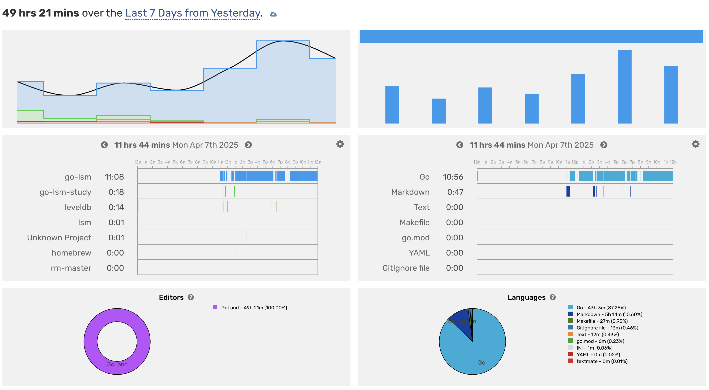

# go-lsm

`go-lsm` is a simple LSM tree implementation in Go.

## References

- [mini-lsm](https://skyzh.github.io/mini-lsm/)
- [whuanle/lsm](https://www.cnblogs.com/whuanle/p/16297025.html)
- [go-lsm](https://github.com/SarthakMakhija/go-lsm)
- [reading-source-code-of-leveldb-1.23](https://github.com/SmartKeyerror/reading-source-code-of-leveldb-1.23)
- [leveldb](https://github.com/merlin82/leveldb)

## Design

In the implementation of LSM-Tree (Log-Structured Merge-Tree), a common design pattern is to utilize SkipList-based MemTable (In-Memory Table) and SSTable (Sorted String Table). This architecture is widely adopted in popular LSM-Tree-based databases like LevelDB and RocksDB.


You can refer to [description](./docs/description.md)

## Log

- Day 1
  - KV structure
  - SkipList
- Day 2
  - Memtable and IMemtable
  - WAL
- Day 3 - Day 6
  - SSTable
  - LRU
  - Memtable Builder
  - SSTable Manager
- Day 7
  - Compaction
  - Test



## Article

> These docs are derived from and modified based on [reading-source-code-of-leveldb-1.23](https://github.com/SmartKeyerror/reading-source-code-of-leveldb-1.23) under BSD-3-Clause license.

- [KV](kv/README.md)
- [Memtable](memory/README.md)
- [WAL](wal/README.md)
- [SSTable](disk/README.md)

## Benchmark

```bash
make bench
```

```text
goos: darwin
goarch: arm64
pkg: github.com/xmh1011/go-lsm/database
cpu: Apple M1 Pro
BenchmarkPut-8          2944513             46883 ns/op
BenchmarkGet-8          143949501              248.1 ns/op
BenchmarkDelete-8       1000000             56224 ns/op
```

```bash
make benchmark
```

```text
==============================================
 测试目录   : /Users/xiaominghao/code/go-lsm/data
 写入数量   : 2000000
 写入耗时   : 1m9.674734583s
 写 ops/s   : 28704.81
 写 ns/op   : 34837.37
 读取数量   : 1000
 读取耗时   : 6m18.351693416s
 读 ops/s   : 5286.09
 读 ns/op   : 378351693.42
==============================================
```

## TODO List

- Performance Optimization
- Tombstone
- MVCC
- Snapshot
- 2 PL
- Data Block Compression