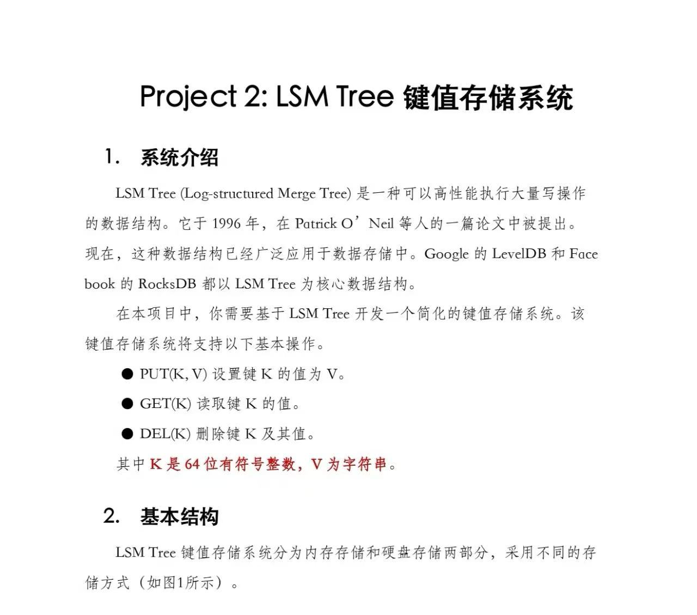
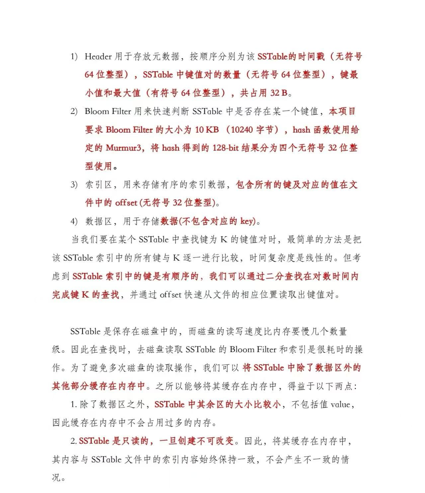
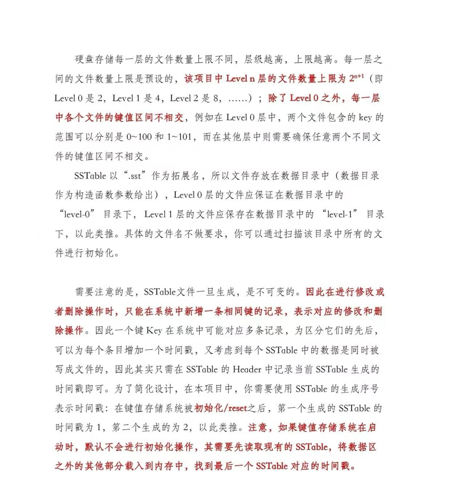
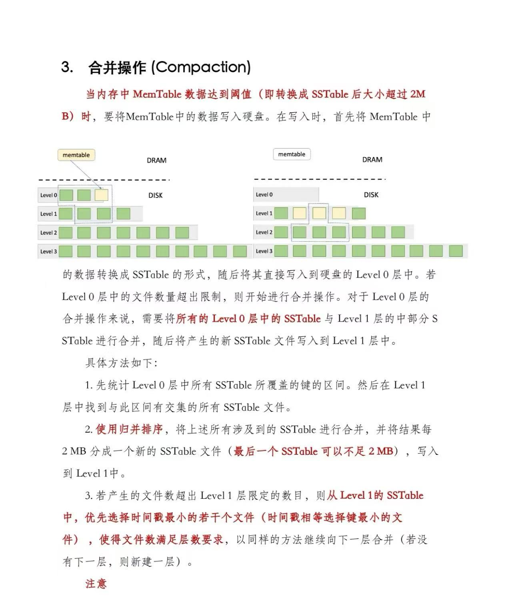
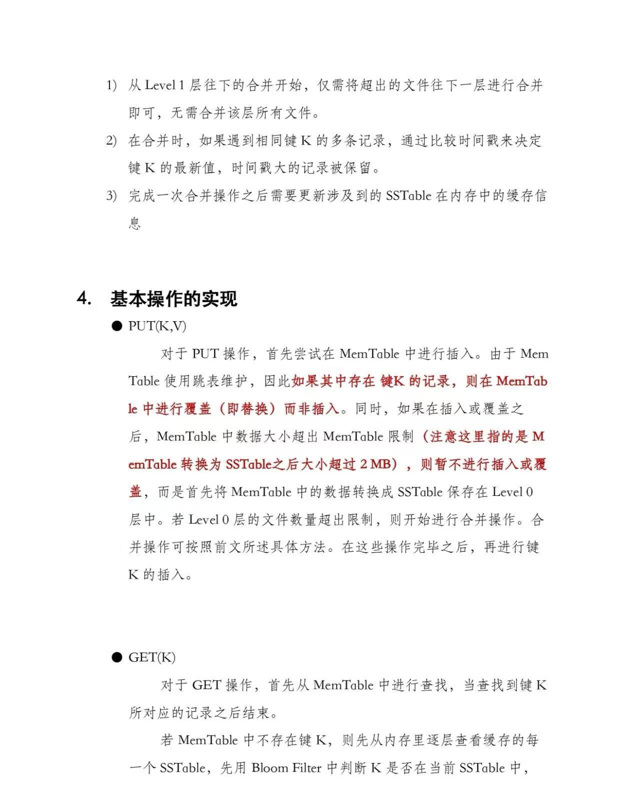
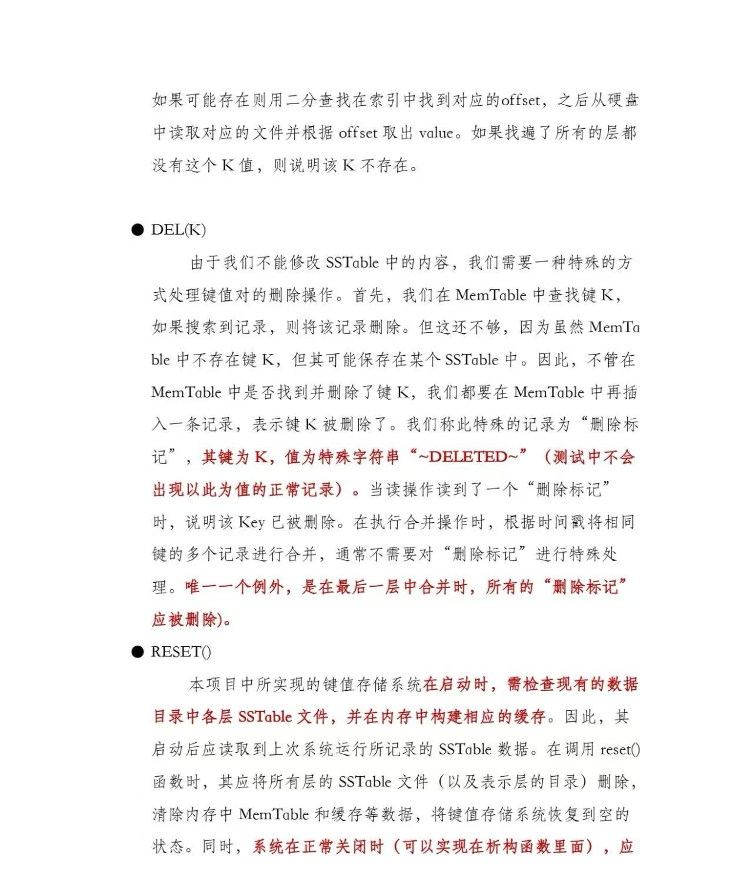
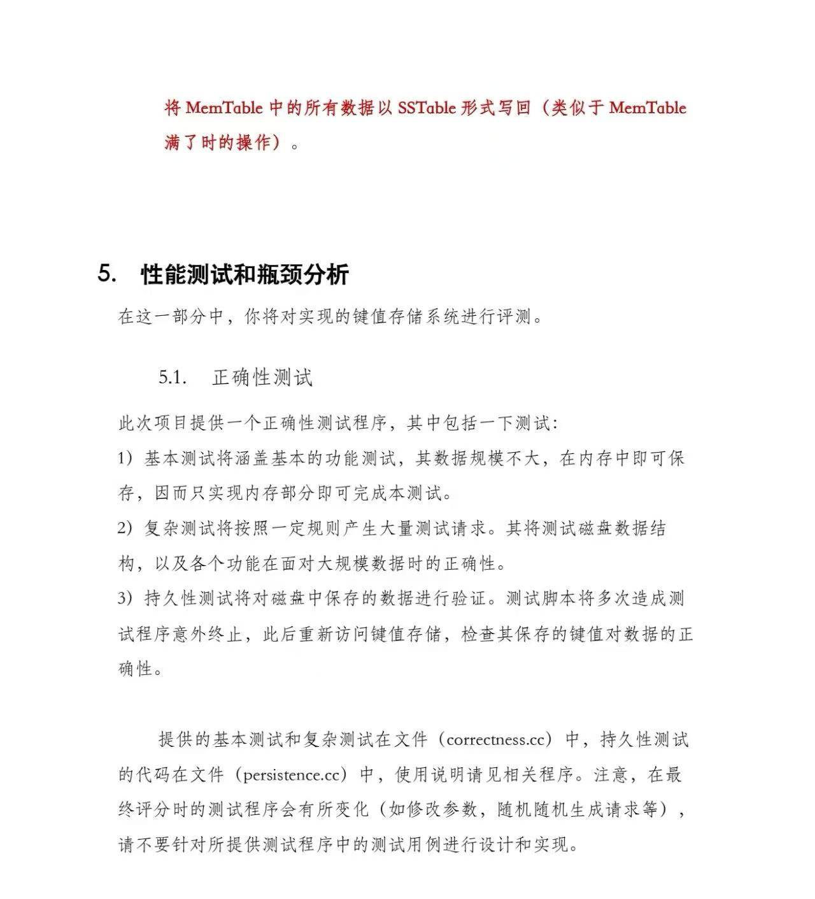
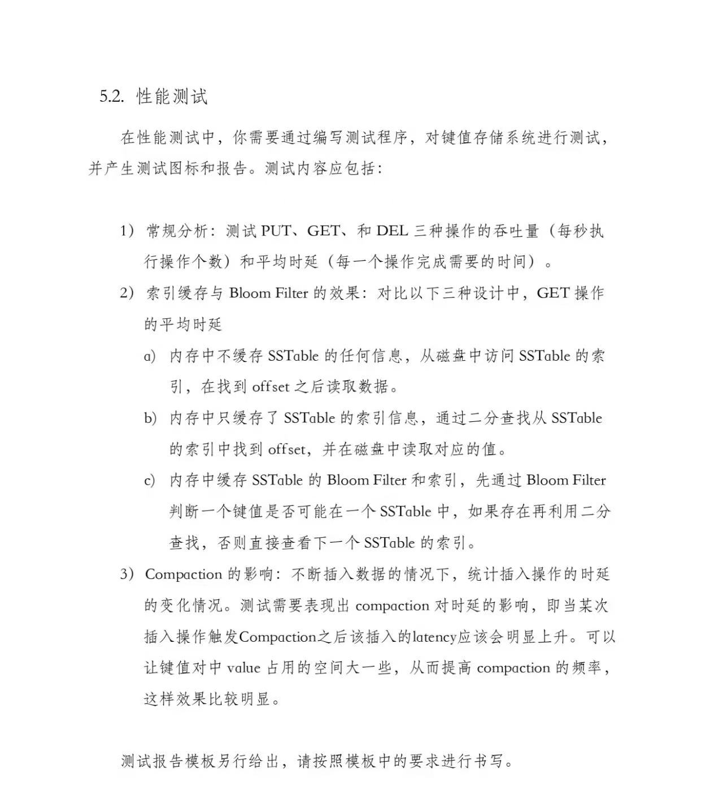
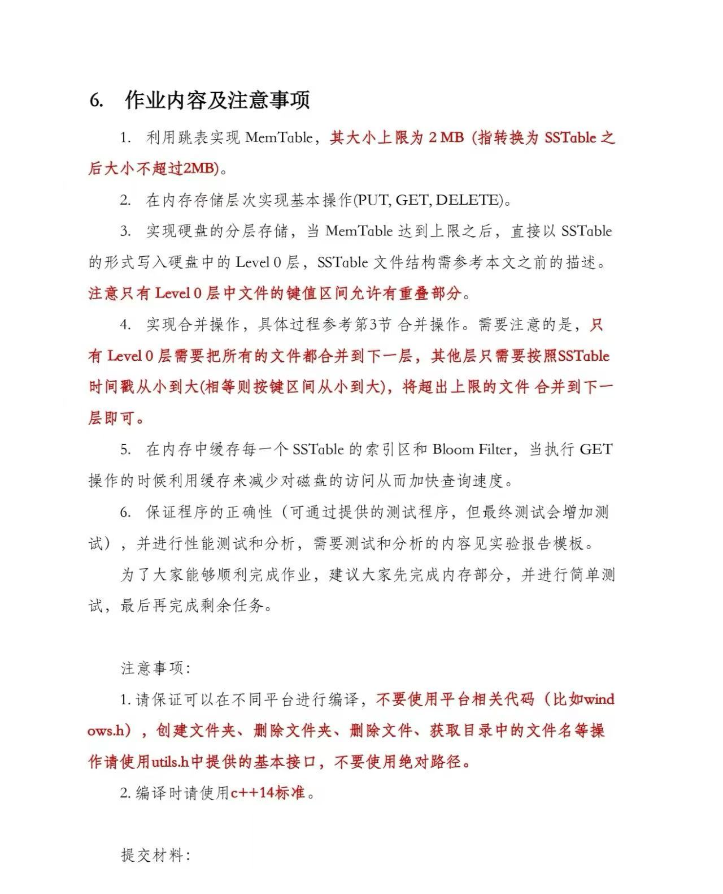
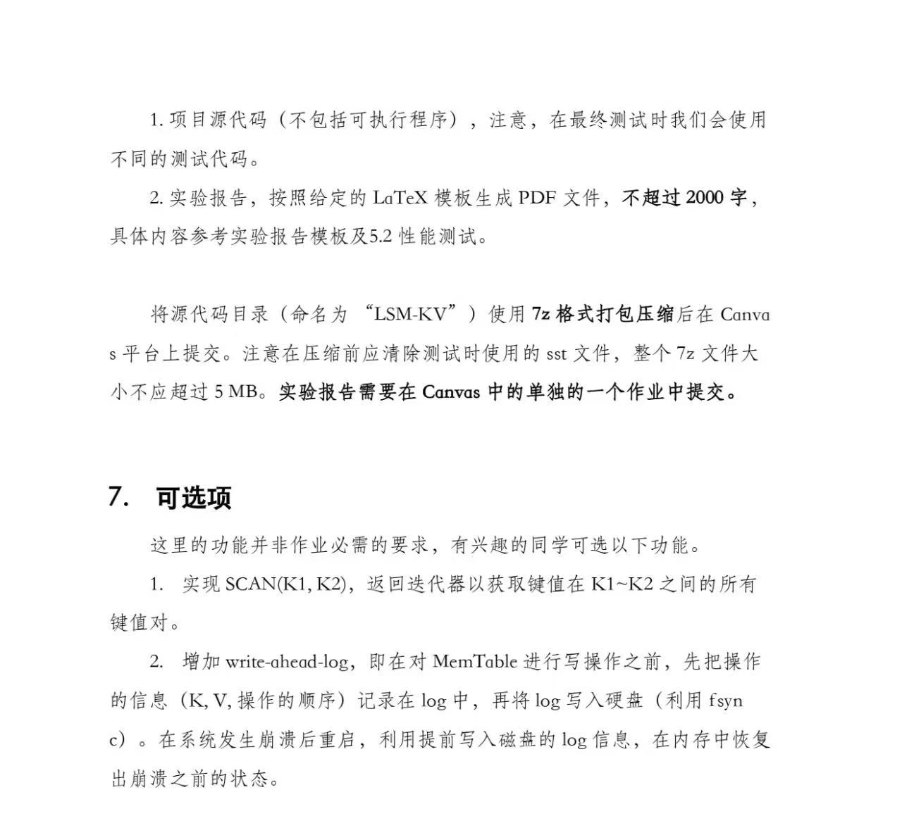

# 整体设计

> 来自：[上交软院 C++ lab](https://www.xiaohongshu.com/explore/66588d66000000001401a3b6?app_platform=ios&app_version=8.77&share_from_user_hidden=true&xsec_source=app_share&type=normal&xsec_token=CBrXJZDgwEyAxhKpMPia8JlwSABTN2kCeY2YN1PgLSGP4=&author_share=1&xhsshare=WeixinSession&shareRedId=OD00NzY9NE02NzUyOTgwNjdGOThGOThC&apptime=1743956875&share_id=a8693f6370744358aa0afc3898d40258)

