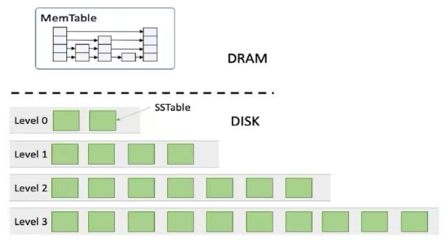
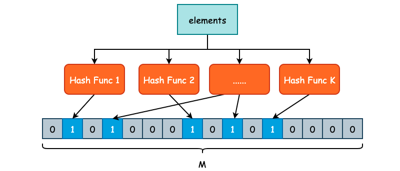
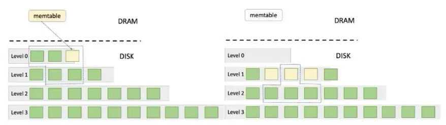
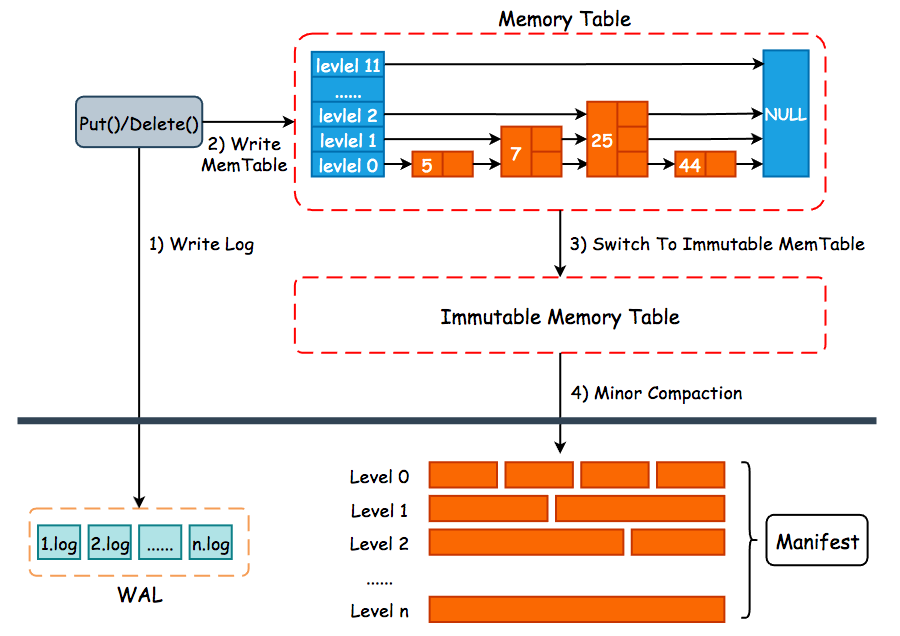

# 1. 系统介绍
LSM Tree(Log-structured Merge Tree)是一种可以高性能执行大量写操作的数据结。它于1996年，在Patrick O'Neil等人的一篇论文中被提出。现在，这种数据结构已经广泛应用于数据存储中。Google的LevelDB和Facebook的RocksDB都以LSM Tree作为核心数据结构。

在本项目中，你需要基于LSM Tree开发一个简化的键值存储系统。该键值存储系统将支持以下基本操作：
- `Put(key, value)`设置键key的值为value
- `Get(key)`读取键key的值
- `Delete(key)`删除键key和其value

其中，key和value都是字符串。

# 2. 概要设计
LSM Tree键值存储系统分为**内存存储**和**硬盘存储**两部分，采用不同的存储方式，如下所示。

内存存储是**可变存储结构**，是可以修改的。硬盘存储是**不可变存储结构**，是不可以修改的。

## 2.1 MemTable
内存存储结构被称为**MemTable**，其通过**跳表或平衡二叉树**等数据结构保存键值对。

## 2.2 SSTable
在LSM树中，数据以**有序字符串表（Sorted String Table，SSTable）**的形式存储在磁盘上。 SSTable是一个不可变的文件，包含一系列键值对，并且这些键值对是有序的。SSTable通常由多个数据块组成，每个数据块包含一部分键值对。 SSTable通常包含两个组件，分别是**索引文件和数据文件**。索引文件保存键和其在数据文件中的偏移量，数据文件由连起来的键值对组成。 每个SSTable由多个页构成，在查询一条数据时，并非像B+树一样直接定位到数据所在的页，而是先定位到SSTable，再根据SSTable中的索引文件找到数据对应的页。

## 2.3 Bloom Filter
**布隆过滤器（Bloom Filter）**常用于判断一个SSTable中是否包含特定的键，布隆过滤器的底层是一个**位图结构**，用于表示一个集合，并能判断一个元素是否属于这个集合。 应用布隆过滤器可以大大减少磁盘的访问次数。但其也存在一定的误判率。由于其位图值基于散列函数进行判定，最终会发生多个值的散列冲突问题。 在判断一个元素是否属于某个集合时，可能会把不属于这个集合的元素误认为属于这个集合，即布隆过滤器具有假阳性。 同时判断一个元素在集合中需要位图中多位值为1，这也从根本上决定了布隆过滤器不存在假阴性。也就是说它可能存在以下两种情形：
- **布隆过滤器判定某个元素不在集合中，那么这个元素一定不在**。
- **布隆过滤器判定某个元素在集合中，那么这个元素可能在，也可能不在**。

如上图所示，我们定义了 K 个不同的哈希函数，同时底层位数组的长度为 M。对于每一个需要被添加至 Bloom Filter 的元素，都需要经过 K 次哈希函数的计算，得到 K 个哈希结果。每一个结果都需要被映射到 `[0, M-1]` 这一区间内，并将位数组对应的位置置为 1。
在判断某一个元素 E 是否存在集合时，同样对 E 进行 K 次哈希计算，并映射到 `[0, M-1]` 区间内，如果每一个位置的值都是 1 的话，那么 Bloom Filter 就认为 E 在这个集合中，反之 E 不在集合中。
由于 Bloom Filter 使用了 K 个不同的哈希函数，减少了哈希碰撞的概率，因此，Bloom Filter 虽然会存在假阳性的情况出现，但是出现概率并不高。

## 2.4 WAL
对于存储引擎来说，为了能够加快写入速度，通常会将数据写入至位于**内存的缓冲区**中（在LSM Tree中就是MemTable），然后由后台线程或者是其它方式再持久化至底层硬盘中。但是这样一来会有数据丢失的风险，因为内存中的数据是易失的。因此绝大多数存储引擎都是采用 **WAL (Write Ahead Log)** 的方式，首先将数据顺序地写入预写日志文件中，再去处理核心写入逻辑，以防止数据在节点宕机时的丢失。LSM 树每一个预写日志的大小为 2MB，和 MemTable 的默认大小保持一致，包含多个连续的日志记录，记录了写入的KV键值对。

## 2.5 Compaction
Compaction主要分为**Minor Compaction**和**Major Compaction**两种类型。整体流程如下所示：

### 2.5.1 Minor Compaction
**当内存中的MemTable数据达到阈值**（即转换成SSTable后大小超过2MB），要将MemTable中的数据写入硬盘。在写入时，首先要将数据转换成SSTable的形式，随后将其直接写入到硬盘的Level 0层中。

### 2.5.2 Major Compaction
如果在Minor Compaction中，**Level 0层的文件超出数量限制**，那么就会触发Major Compaction。对于Level 0层的合并操作来说，需要将所有Level 0层中的SSTable与Level 1层中的部分SSTable进行合并，随后将产生的新SSTable文件写入到Level 1层中。具体流程如下：
- 先统计Level 0层中所有SSTable所覆盖的键的区间。然后在Level 1层中找到与此区间有交集的所有SSTable文件。
- 使用归并排序，将上述所有涉及到的SSTable进行合并，并将结果每2MB分成一个新的SSTable文件（最后一个SSTable可以不足2MB），写入到Level 1层中。
- 若产生的文件数超过Level 1层的限定数目，则从Level 1的SSTable中，优先选择时间戳最小的若干个文件（时间戳相当选择键最小的文件），使文件数满足层数要求，以同样的方法继续向下一层合并（若没有下一层，则新建一层）。

## 2.6 Function
### 2.6.1 Put(key, value)
对于`Put`操作，**首先尝试在MemTable中进行插入**。由于MemTable使用跳表进行维护，因此如果其中存在键Key的记录，则在MemTable中进行覆盖而非插入。同时，如果在插入或者覆盖之后，MemTable中数据大小超过MemTable的限制，也就是转换成SSTable之后大小超过2MB，则暂不进行插入或覆盖，而是首先将MemTable中的数据转换成SSTable保存在Level 0层中。若Level 0层的文件超出数量限制，则开始进行合并操作。在这些操作完毕之后，再进行插入操作。

### 2.6.2 Get(key)
对于`Get`操作，**首先从MemTable中进行查找**，当查找到键Key所对应的记录之后结束。当MemTable中不存在键Key，则先从内存里逐层查看缓存的每一个SSTable，先用Bloom Filter判断K是否在当前的SSTable中，如果可能存在则用二分查找在索引中找到对应的offset，之后从硬盘中读取对应的文件并根据offset取出value。如果找遍了所有的层都没有这个Key值，则说明Key不存在。

### 2.6.3 Delete(key)
由于SSTable是不可变存储结构，其中内容不可修改，所以需要一种特殊的方式处理键值对的删除操作。首先，我们在MemTable中查找键Key，如果能搜索到记录，则将该记录删除。若MemTable不存在键Key，但其可能保存在某个SSTable中。因此，不管在MemTable中是否找到并删除了键Key，我们都需要在MemTable中再插入一条记录，表示键Key被删除了。我们称此特殊的记录为“删除标记”，其键为K，值为特殊字符串`～DELETED～`。当读到了一个“删除标记”，意味着该Key已经被删除。在执行合并操作时，根据时间戳将相同键的多个记录进行合并，通常不需要对“删除标记”进行特殊处理。唯一一个例外是，在最后一层中合并时，所有的“删除标记”应该都被删除。

### 2.6.4 Reset()
在本项目启动时，需检查现有的数据目录中各层SSTable文件，并在内存中构建相应的缓存，检查WAL目录，恢复存储在内存中的MemTable。在系统正常关闭时，应将MemTable中的所有数据以SSTable形式写回。

# 3. 实现
## 3.1 内存驻留组件
### 3.1.1 机制
内存驻留组件由**MemTable**和**Immutable MemTable**组成。数据在MemTable中以有序的跳表结构进行存储，以保证磁盘数据的有序行。MemTable负责缓冲数据记录，Immutable MemTable完成对于数据的落盘操作。内存驻留组件用于临时存储新写入的数据，以进一步提高写入性能。**一旦其达到一定大小，它将被写入到磁盘或闪存，并形成一个SSTable文件**，其中数据按键有序排列。

**WAL（Write-Ahead Log，预写日志）机制**是现代数据库和存储引擎中确保数据**持久性与一致性**的重要手段。它的核心思想是：**在对内存数据结构（如 MemTable）进行变更前，先将变更操作记录到持久化日志中（WAL）**，确保即使系统崩溃，也可以通过日志恢复数据。

### 3.1.2 设计
为了追求读取性能优化，采用在内存中存储一张 MemTable 和十张 Immutable MemTable 操作，方便查询时快速找到 key。 Immutable MemTable 采用 FIFO 的淘汰机制，被淘汰的 Immutable MemTable 会被持久化到磁盘中，形成一个 SSTable 文件。
- 为什么不用 LRU 机制管理 Immutable MemTable？
    - 因为 LSM 树在查询同一个 key 时，需要匹配最新的 key，因此需要查询最新的 Immutable MemTable。
- 为什么增加Immutable MemTable这一组件？
    - 因为Immutable MemTable是完全加载在内存中的，并且不会占用过多内存（2MB一张，10张占用20MB），对于内存中的数据查询较快，牺牲一部分内存占用换取更高效的查询性能。并且LSM Tree的应用场景就是，通常最近写入的数据被查询的更频繁，也是对应用场景的适应。

当用户执行写操作（如插入或更新 key-value 数据）时，系统不会立即将数据写入磁盘上的最终结构（如 SSTable），而是：
1. 首先将操作追加写入 WAL 文件（顺序写，磁盘友好）
2. 然后更新内存中的 MemTable
3. 当 MemTable 达到一定大小，会被转为不可变的 Immutable MemTable
4. 如果Immutable MemTable数量达到上限，将最老的 Immutable MemTable 持久化为 SSTable
5. 对应的 WAL 也会被删除或归档
6. 此时若需要合并操作，会同步等待Level 0层合并完成（为了保证数据的一致性），异步执行Level 1及以上的合并操作。

整体操作流程如下所示：

这样设计的好处是：
- 即使系统崩溃，只要 WAL 存在，就能恢复 MemTable 的内容，不会丢失已提交的数据；
- MemTable 提供高速访问，而 WAL 提供持久保证；
- 转换为 SSTable 后，WAL 可被安全删除，节省空间。

## 3.2 磁盘驻留组件
### 3.2.1 机制
硬盘存储采用分层存储的方式进行存储，每一层包括多个文件，每个文件被称为SSTable（Sorted Stings Table），用于有序地存储多个键值对，该项目中一个SSTable的大小为2MB，结构如下所示，被分为四个部分。

- **Header**，用于存放元数据，按照顺序分别为键最大值和最小值。
- **Bloom Filter**，用来快速判断SSTable中是否存在某一个键值，本项目要求Bloom Filter的大小为10KB（10240字节），hash函数使用给定的Murmur3，将hash得到的128-bit结果分为四个无符号32位整型使用。
- **索引区**，用来存储有序的索引数据，包含所有键及对应值在文件中offset（无符号32位整型）。
- **数据区**，用于存储数据（不包含对应的key）。

而实际应用中，为了解码和写入的便捷性能，实际上是先写入数据区，再写入索引区。并且新增Footer（固定16字节）位于文件最后，记录索引区的Offset和Size。
- 先写入数据区，在写入数据区的时候就可以记录对应Value的Offset，记录到索引区中。提高写入性能。
- 在解析时，可以通过Footer直接解析索引区，可以不用解析数据区，提升重启后的解析性能。也可以通过Footer直接解析数据区和索引区，提升合并操作的性能，减少IO。

当我们要在某个SSTable中查找键为Key的键值对时，最简单的方法是把该SSTable索引中的所有键与Key逐一进行比较，时间复杂度是线性的。但是考虑到SSTable索引中的键都是有序的，我们可以通过二分查找在O(logn)时间内完成对于Key的查找，并且通过offset快速从文件的相应位置读取出键值对。

SSTable是保存在磁盘中的，而磁盘的读写速度比内存要慢几个数量级。因此在查找时，去磁盘读取SSTable的Bloom Filter和索引是很耗时的操作。为了避免多次磁盘的读取操作，我们可以将SSTable中除了数据区以外的其他部分缓存在内存中。之所以能够将其缓存在内存中，得益于以下两点：
- 除了数据区之外，SSTable中其余区的大小比较小，不包括值value，因此缓存在内存中不会占用过多的内存。
- SSTable是只读的，一旦创建不可改变。因此，将其缓存在内存中，其内容与SSTable文件中的索引内容是中保持一致，不会产生不一致的情况。

### 3.2.2 存储
硬盘存储每一层的文件数量上限不同，层级越高，上限越高。每一层之间的文件数量上限是预设的，该项目中level n层的文件数量上限为$2^{n+1}$；除Level 0之外，每一层中各文件的键值区间不相交。SSTable以“.sst”作为拓展名，文件存放在对应的数据目录之中，Level 0层的文件应该保证在“level-0”目录下。

Header、索引区和数据区存储的数据类型都是字符串，采用小端存储，并且采用固定长度编码（4字节无符号整型）来存储数据的长度。
- 为什么不用variant编码，更节省空间？
    - 索引区记录的offset指向的是value的起始位置，而value的结构为“长度+数据”。即使通过offset定位到了起始位置，仍需解析长度字段以确定值的实际长度，从而正确读取数据。而固定长度编码的解析复杂度远低于variant编码，相当于牺牲了一部分磁盘空间，换取了更好的查询性能，同时降低了CPU的占用。

### 3.2.3 查找
需要注意的是，SSTable文件一旦生成，是不可变的。因此在进行修改或者删除操作的时候，只能在系统中新增一条相同键的记录，表示对应的修改和删除操作。因此一个键Key在系统中可能对应多条记录，为区分它们的先后，可以为每个条目增加一个时间戳，又考虑到每个SSTable中的数据是同时被写成文件的，因此其实只需要在SSTable的Header中记录当前SSTable生成的时间戳即可。为了简化设计，在本项目中，你需要使用SSTable的生成序号表示时间戳：在键值存储系统被初始化/reset之后，第一个生成的SSTable的时间戳为1，第二个生成的为2，以此类推。注意，如果键值存储系统在启动时，默认不会进行初始化操作，其需要先读取现有的SSTable，将数据区之外的其他部分载入到内存中，找到最后一个SSTable对应的时间戳。

## 3.3 压缩
### 3.3.1 机制
- Minor Compaction 在本系统设计中，为了加快查询性能，会在内存中存储10张Immutable Memory Table，这也是不可变的。一旦Immutable Memory Table的数量超过限制，则按照FIFO的原则进行淘汰，将淘汰掉的Immutable Memory Table持久化为SSTable，写入磁盘，并且删除对应的wal文件。
- Major Compaction 用于SSTable的压缩。按照层级进行。具体流程为：
    - 收集 Level0 文件，解码其 DataBlock，并统计全局 key 区间。
    - 从 Level1 中找出与该区间交集的文件，将其 DataBlock 一并取出。
    - 使用归并排序将所有块合并分块，产出新 SSTable（写入 Level1）。
    - 删除旧 Level0 和 Level1 文件，并加入新文件记录。
    - 如果 Level1 超限，异步触发后续合并。
    - 以此类推，合并下面的层。

### 3.3.2 实现
在本项目中，为优化存储结构和平衡读写性能，压缩机制可分为同步压缩（Level0 → Level1）和异步压缩（Level1+）两部分。
- **分层存储与压缩策略**
    - Level0：存储最新写入的数据（直接从 MemTable 刷盘生成），文件可能存在键范围重叠。
    - Level1+：数据按键排序存储，文件间无重叠。
- 压缩触发条件：当某层文件数量或大小超过阈值时，触发压缩。
- 同步 vs 异步压缩
    - **Level0 同步压缩**：直接阻塞写入流程，确保 Level0 的文件尽快合并到 Level1，避免堆积影响读取性能。
    - **Level1+ 异步压缩**：通过后台协程（go 关键字）异步处理，避免阻塞主流程，适合耗时较长的高层级压缩。
- 异步压缩流程
    - 启动异步压缩 → 检查是否需要压缩 → 执行压缩 → 递归检查下一层 → 退出
    - 关键步骤：
        - **等待前置压缩完成**。确保同一层级没有其他压缩任务在运行（避免并发冲突），通过条件变量实现等待/通知机制
        - **标记压缩状态**：记录当前层级正在压缩，防止重复任务。
- 同步压缩流程
    - 与异步压缩的核心逻辑相同，但同步调用。
    - 关键点：
        - **阻塞主流程**：确保 Level0 的文件及时合并，避免堆积影响读取性能。
        - **递归合并**：如果合并后 Level1 仍超限，直接同步处理下一层级。

## 3.4 读写
### 3.4.1 机制
- 读：LSM Tree的数据读取是分级进行的。当查找一个Key时，首先在MemTable中查找。如果没有找到，那么就去Immutable MemTable中查找（优先查找最新的）。如果还未找到，那么从 level 0 开始，在SSTable中查找（优先查找最新的），直到返回相应的value。保证每次查找时，优先匹配最新的记录，不会查到过期记录。
- 写：一条数据首先要写入WAL文件，这样可以保证恢复时数据的一致性。因为WAL文件是顺序写入，不会占用过多性能。写入WAL文件后，再将记录写入MemTable中。根据MemTable的大小，来决定是否转化为Immutable  MemTable。依次向下递进，判断是否需要转化为SSTable，是否需要触发压缩流程。在触发压缩流程时，按照对KV对进行归并排序，相同的Key只保留最新的一条记录，这样可以保证在查找时匹配最新的记录。

为什么LSM树的写入要比B+树更快？
- **LSM树：纯顺序写**
  - **追加写入（Append-only）**：所有新数据直接写入内存中的MemTable（跳表或有序数组），达到阈值后刷盘到不可变的SSTable（Sorted String Table），全程无需修改已有文件。
  - **顺序I/O**：SSTable按键有序存储，新文件直接追加到磁盘末尾，充分利用了磁盘/SSD的顺序写入带宽（尤其是SSD的顺序写速度可达随机写的100倍以上）。
  - **无覆盖写**：避免了B+树中因节点分裂导致的随机修改，减少了写放大。
- **B+树：随机写主导**
  - **原地更新（In-place Update）**：插入或更新数据时，需定位到具体叶子节点，修改后可能触发节点分裂，导致随机写入（即使使用WAL日志，最终仍需修改树结构）。
  - **随机I/O瓶颈**：磁盘的随机写性能极差（寻道时间+旋转延迟），SSD虽无机械延迟，但随机写仍需擦除和重写整个块，导致吞吐量下降。

### 3.4.2 实现
如果对每一个KV对都存储时间戳或者版本号，那么会占用过多的存储空间，也会影响读写性能。所以在本项目中，采用自增ID来保证SSTable中的KV对的先后顺序。