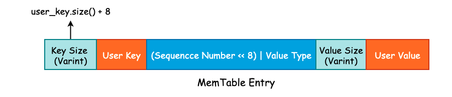

# Varint 与 Key

在 leveldb 中，int32 或者是 int64 采用的是变长存储，这一空间优化在 gRPC 中也有使用。其原理就是将原本需要使用 4 字节存储的 int32 或者是 8 字节存储的 int64 根据整数的实际大小使用不同的字节数进行存储。

比如说现在我们有一个 int32，其值为 1024，那么完全可以使用一个 int16 进行存储。但是因为我们需要考虑到存储值的上限，所以必须使用 int32 来实现。变长整数就是为了解决无论多大的数字都需要使用 4 字节 或者 8 字节 进行存储的问题的。

varint 是一种使用一个或多个字节序列化整数的方法，会把整数编码为变长字节。对于 32 位整型经过 varint 编码后需要 `1~5` 个字节，小的数字使用 1 字节，大的数字使用 5 字节。而 64 位整数根据 varint 编码后需要 `1~10` 个字节。在实际业务场景中，小整数的使用频率要远超于大整数的使用频率，因此使用 varint 编码能够有效的节省内存和硬盘的存储空间。

## Varint 编码

对于 varint 编码而言，每一个字节的最高位为保留位，1 表示后面仍有数据，0 则表示当前字节是 varint 的结尾。也就是说，varint 的每一个字节只能使用 7 位，所以当我们有一个 64 位长度的整型需要进行 varint 编码时，必须使用 10 个字节才能表示。这比原来的 8 字节还要多出 2 个字节，所以，varint 并不适合用于大整数占比非常多的情况。

可以参考 `ReadUvarint` 和 `WriteUvarint` 方法的实现。

## Key

使用 Skip List 来实现位于内存中的 MemTable，并提供了 `Add()` 方法将 Key-Value 写入至 Skip List 中。在 Skip List 的实现中，我们并没有发现 Value 字段，这是因为这是将 User Key 和 User Value 打包成一个更大的 Key，直接塞到了 Skip List 中。

