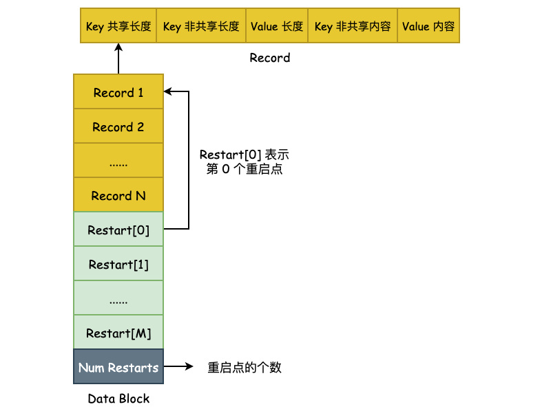
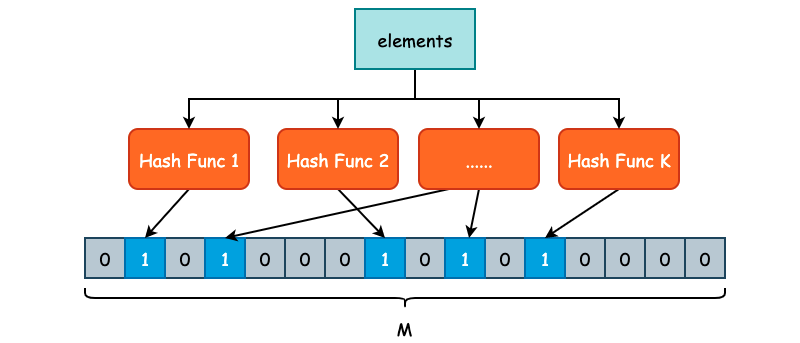
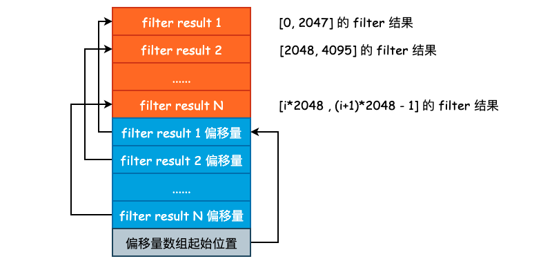
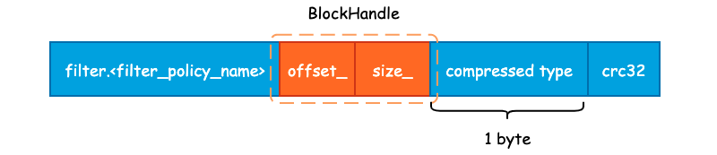

# 磁盘驻留组件

## 设计

在内存中通过记录了 100 张 SSTable 的元信息。方便快速查找。记录顺序是从低层级到高层级，从最新文件到最旧文件。
也就是：低层级最新文件 > 低层级旧文件 > 高层级最新文件 > 高层级旧文件。

查找时，从低层级到高层级，按照文件的 id，也就是时间戳，来查找。先查层级低的，最新的文件。

由 LSM 树的写入和压缩策略可知，L0 的 SSTable 之间，每个 SSTable 的 key 的区间是有重叠的，而由于合并策略，L1 及以上的 SSTable，在每一层内， key 的区间都是不重叠的。

所以可以根据这一特性，进行查询性能的优化。可以对 L1 及以上的层级用二分查找结合布隆过滤器，同时查找。

```text
       +--------------+
       |   MemTable   |   ← 内存，优先查找
       +--------------+
              ↓
   +-------------------+
   | ImmutableMemTable | ← 内存只读表
   +-------------------+
              ↓
       +--------------+
       |  L0 SSTables  | ← 多个文件，可能有重叠，逐个查找
       +--------------+
              ↓
   +------------------------+
   |  L1 ~ Ln SSTables      | ← 无重叠，可二分查找，逐层查询
   +------------------------+
```

```text
Search(key)
   ↓
for each level (0→6)
   ↓
for each file (newest→oldest)
   ↓
Load SST meta (if not in memory)
   ↓
Bloom Filter: MayContain(key)?
   ↓         ↓
false      true
 ↓           ↓
skip     IndexBlock → Locate block
           ↓
         Seek in block
           ↓
       Found? → Return
```

## SSTable

在LSM树中，数据以有序字符串表（Sorted String Table，SSTable）的形式存储在磁盘上。
SSTable是一个不可变的文件，包含一系列键值对，并且这些键值对是有序的。SSTable通常由多个数据块组成，每个数据块包含一部分键值对。
SSTable通常包含两个组件，分别是索引文件和数据文件。索引文件保存键和其在数据文件中的偏移量，数据文件由连起来的键值对组成。
每个SSTable由多个页构成，在查询一条数据时，并非像B+树一样直接定位到数据所在的页，而是先定位到SSTable，再根据SSTable中的索引文件找到数据对应的页。


上图为 SSTable 格式的总览，**主要由 Data Block、 Meta Block、Metaindex Block、Index Block 以及 Footer 所组成**，主要分为 3 部分: 用户数据、元数据以及索引数据，其作用如下:

- Data Block: 按照 `Comparator` 所定义的大小关系按顺序存储 User Key 以及 User Value。为了节省存储空间，leveldb 将会对 User Key 进行前缀压缩存储，将于下文详述。
- Meta Block: 用于快速 filter 某一个 User Key 是否在当前 SSTable 中，默认为 Bloom Filter。
- Metaindex Block: 指向 Meta Block 的索引，用于快速定位 Meta Block。
- Index Block: 指向 Data Block 的索引，用于快速定位 Data Block。
- Footer: 其中包含了 Metaindex Handle 和 Index Handle，其中 Metaindex Handle 指向 Metaindex Block 的起始位置和大小，Index Handle 则指向了 Index Block 的起始位置和大小，可以认为是索引的索引。

[从零构建一个SSTable](https://www.bilibili.com/video/BV18S4y187eH/?spm_id_from=333.337.search-card.all.click&vd_source=056cb144b0c421d2b061ffeefde2420f)

[golang实现SSTable](https://www.bilibili.com/video/BV1Qb411T7kV/?spm_id_from=333.337.search-card.all.click&vd_source=056cb144b0c421d2b061ffeefde2420f)

---

## Data Block

User Key 和 User Value 在 leveldb 中是未做分离处理的，也就是说每一对 Key-Value 都会按照一定的顺序存储到 Data Block 中，并且 Data Block 是从文件起始位置连续存储的。在一个 Data Block 中，可能会有多条数据记录，同时由于这些数据记录是有序存储的（默认为字典序），那么相邻的两条数据之间的 User Key 就有很大的可能性出现前缀重叠，如下图的 4 个 User Key，它们都具有相同的 "sma" 前缀:


如此一来，leveldb 就可以对其进行前缀压缩处理了。对于有序的字符串而言，这么做能够节省非常多的存储空间，但是会对查询增加复杂度，也会影响查询效率。因此，leveldb 为了解决这个问题，额外引入了 Restart Point（重启点）。

Restart Point 的实现非常简单，leveldb 规定每隔 K 个 User Key，将不采用前缀压缩，而是直接存储整个 User Key，用于降低查询时的复杂度。K 值定义在 `Options.block_restart_interval` 中，默认为 16。也就是说，每隔 16 个 User Key 就存储完整的记录。同时，使用 Restart 数组来记录下这些 Restart Point 的文件偏移量，便于进行二分查找。如下图所示:



但是实际上本代码的设计中并为实现前缀压缩和重启点的设计。只是采用小端存储，存储格式为：

```
┌────────────┬──────────┬──────────────┬────────────┐
│ key length │ key data │ value length │ value data │
└────────────┴──────────┴──────────────┴────────────┘
```

---

## Meta Block

本节描述 SSTable 第二个关键组成部分，Meta Block。Meta Block 存在的目的就是为了优化 SSTable 的读取性能，leveldb 使用 Bloom Filter 作为 Filter 的具体实现，用于快速判断某一个 User Key 是否存在于当前查找的 SSTable 中。若 Bloom Filter 给出了 `false` 的答案，那么待查找 User Key 必然不在当前 SSTable 中。若给出了 `true` 的答案，待查找 User Key 也不一定会在当前 SSTable 中，因为 Bloom Filter 存在“假阳性”的可能。

### 布隆过滤器

布隆过滤器（Bloom Filter）常用于判断一个SSTable中是否包含特定的键，布隆过滤器的底层是一个位图结构，用于表示一个集合，并能判断一个元素是否属于这个集合。
应用布隆过滤器可以大大减少磁盘的访问次数。但其也存在一定的误判率。由于其位图值基于散列函数进行判定，最终会发生多个值的散列冲突问题。
在判断一个元素是否属于某个集合时，可能会把不属于这个集合的元素误认为属于这个集合，即布隆过滤器具有假阳性。
同时判断一个元素在集合中需要位图中多位值为`1`，这也从根本上决定了布隆过滤器不存在假阴性。也就是说它可能存在以下两种情形：
- 布隆过滤器判定某个元素不在集合中，那么这个元素一定不在。
- 布隆过滤器判定某个元素在集合中，那么这个元素可能在，也可能不在。

布隆过滤器使用一个大的比特数组和多个哈希函数构建。将这些哈希函数应用于表中记录的键。并将哈希值作为数组下表来将其对应比特位设置为`1`。
如果哈希函数所确定的所有比特位都为`1`，则表示该搜索键在该集合中是可能存在的，在查找过程中，当检查布隆过滤器中的元素是否存在时，需要在此计算键的哈希函数：
如果所有哈希函数确定的位都为`1`，则返回肯定的结果，说明该项目有一定的概率是集合中的所有成员；
如果至少有一个位为`0`，则返回否定的结果，说明该项目一定不在集合中。

布隆过滤器特征：
- 高效节省空间：布隆过滤器不存储数据本身，只存储数据对应的哈希比特位，因此占用空间非常小。
- 快速的插入和查询：插入和查询操作的时间复杂度都为 O(k)，其中 k 为哈希函数的个数，这使得布隆过滤器在处理大量数据时非常高效。
- 存在假阳性：由于哈希碰撞的可能性，布隆过滤器在判断元素存在时可能会出现误判，即元素实际上不在集合中，但过滤器错误地认为其存在。这种误判率取决于哈希函数的个数和位数组的长度。
- 不支持删除操作：一旦一个元素被添加到布隆过滤器中，很难将其准确地删除。因为多个元素可能会共用位数组中的某些位，删除一个元素可能会影响其他元素的判断结果。
- 灵活性与可配置性：布隆过滤器的误判率、位数组的长度和哈希函数的个数都是可以根据具体应用场景进行调整的，以达到最优的性能和误判率平衡。

参考代码：[bloom](https://github.com/bits-and-blooms/bloom)



如上图所示，我们定义了 K 个不同的哈希函数，同时底层位数组的长度为 M。对于每一个需要被添加至 Bloom Filter 的元素，都需要经过 K 次哈希函数的计算，得到 K 个哈希结果。每一个结果都需要被映射到 `[0, M-1]` 这一区间内，并将位数组对应的位置置为 1。

在判断某一个元素 E 是否存在集合时，同样对 E 进行 K 次哈希计算，并映射到 `[0, M-1]` 区间内，如果每一个位置的值都是 1 的话，那么 Bloom Filter 就认为 E 在这个集合中，反之 E 不在集合中。

由于 Bloom Filter 使用了 K 个不同的哈希函数，减少了哈希碰撞的概率，因此，Bloom Filter 虽然会存在假阳性的情况出现，但是出现概率并不高。

假设位数组的大小为 M，用户插入数据总量为 N，并且存在 K 个哈希函数，为了获得比较好的过滤表现，K 的取值应为 `ln2 * (M/N)`。在错误率不大于 E 的情况下，M 至少应该为 `N * lg(1/E)` 才能在有 N 个元素的情况下表现良好。

### Filter Block

Filter Block 其实就是 Meta Block，使用 Filter Block 的原因在于这个名称更容易理解。

首先，Filter Block 的作用就是对 SSTable 中 Data Block 的所有 User Key 建立布隆过滤器，并将结果（string 对象）写入到 Filter Block 中。如果说我们把所有的 User Key 都放在一个 Bloom Filter 中的话，按照 `bits_per_key` 为 10 来计算的话，就有如下计算过程:

假设 User Key 和 User Value 的平均长度为 32 字节，再加上辅助的 varint 字段，一条记录假设占用 70 字节的长度。一个 SSTable 的默认大小为 2MB，那么就可以存放 `2 * 1024 * 1024 / 70`，约为 3 万条记录。也就是说，布隆过滤器底层使用的位数组长度为 `30000 * 10 = 300000`，大约为 300KB。

在查询 SSTable 中，首先会去 Bloom Filter 中判断待查找 User Key 是否在当前 SSTable 中，那么就需要将这 300KB 的 Filter Result 全部读取到内存中进行判断，而常见的 I/O Buffer Size 大小为 4KB，也就是说，需要多次 I/O 才能将数据读取至内存。

**为了减少 I/O 时间，我们完全可以将单一的 Bloom Filter 划分成多个 Bloom Filter，每一个 Bloom Filter 只负责一部分的 User Key，并且由于 User Key 在 SSTable 中是有序存储的，因此可以很方便地建立 Filter Result 的索引**。这其实就是 Filter Block 和 Metaindex Block 所做的事情。

leveldb 采用的是按照固定大小进行划分，目前划分的大小为 2KB，也就是在 Data Block 中，每 2KB 的 User Key 和 User Value 就会有一个 Bloom Filter Result，如下图所示:



---

## Index Block

在前面我们已经将 Data Block 和 Filter Block 的格式和内容梳理完毕了，由于 Data Block 和 Filter Block 在文件中是连续存储的，并且大小不固定，所以需要为其建立索引，也就是 Metaindex Block 和 Index Block。

### Metaindex Block

Metaindex Block 用于存储 Filter Block 在整个 SSTable 中的索引信息，并且只有一行记录，只需要记录下所使用的 Filter Policy 名称，以及 `BlockHandle` 信息。首先来看下 `BlockHandle` 对象:

也就是说，对于 Filter Block 而言，只需要记录下 Filter Block 的起始地址和大小即可，下面为 Metaindex Block 的完整记录信息:



Metaindex Block 的起始位置为 "filter." 和过滤器名字所组成的一个常量字符串。本代码不支持配置过滤策略，因此这个字段并不会在SSTable中存储。

紧接着就是 `BlockHandle` 的内容，这部分的内容起始就是 Filter Block 在 SSTable 的起始偏移量和 Filter Block 的大小，使用 varint64 变长编码的方式写入至结果字符串中。

最后，就是 Block 的统一格式后缀了。包括 1 字节的压缩类型，默认为 snappy 压缩，以及 4 字节的 CRC32 校验和。

### Index Block

Index Block 的作用除了记录下每个 Data Block 的起始位置和大小以外，还会额外记录每一个 Data Block 的最大 Key 值。

记录下每一个 Data Block 的最大 Key 值主要目的就是为了方便二分搜索算法的执行，降低查询 SSTable 的时间复杂度，Index Block 的格式如下图所示:


这种记录下每一个 Data Block 的最大 Key 值其实和 InnoDB Page Directory 非常之类似，通过记录一些额外的信息来优化搜索。关于 Page Directory 更详细的信息，可参考另一个项目 Psyduck: [InnoDB 数据页结构](https://smartkeyerror.oss-cn-shenzhen.aliyuncs.com/Phyduck/database/InnoDB-Page.pdf)。

紧接着就是常规的 `BlockHandle` 内容以及 Compressed Type 和 CRC32 了。

### Footer

最后我们再来看下 Footer。Footer 大小固定，为常量值 48 字节。Data Block 中的每一个 Block 由 Index Block 进行索引，Filter Block 的起始地址由 Metaindex Block 进行索引。由于 Index Block 和 Metaindex Block 的大小同样不固定，所以我们还需要对 Index Block 和 Metaindex Block 进行索引，并且这个索引的大小和所处文件位置必须是固定的，否则我们就缺少了一个入口点。

除了这两个索引以外，leveldb 还会在 SSTable 的结尾处写入一个名为 kTableMagicNumber 的“魔数”，具体作用笔者也还没有整明白，其内容为 "http://code.google.com/p/leveldb/" 使用 sha1 哈希之后的前 8 个字节。Footer 的整体布局如下图所示:


---

## Compaction

Compaction 一共可分为三种: Minor Compaction、Major Compaction。

其中 Minor Compaction 特指将位于内存中的 Immutable MemTable 持久化至硬盘中。Major Compaction 则是 leveldb 运行中最为核心的数据合并过程，主要是将位于不同层级的 SSTable 进行合并，以减少同一个 Key 的存储空间。

Minor Compaction 相对于其它两者要更简单一些，并且是所有 SSTable 的“出生地”，即在 Minor Compaction 中，将会调用上一篇提到的 `BuildSSTableFromIMemtable()` 方法创建 SSTable，并将 Immutable MemTable 的内容写入。

### Minor Compaction

当 MemTable 已经没有剩余的写入空间，并且 Immutable MemTable 不存在时，会将当前的 MemTable 转变为 Immutable MemTable，并初始化一个新的 MemTable 以供写入，同时主动地触发 Minor Compaction。


上图为 leveldb Key-Value 写入过程，我们只需要关注何时进行 Run Compaction 即可。

Minor Compaction 的入口点为 `CreateNewSSTable` 方法。

`CreateNewSSTable` 主要完成了三件事情:

- 根据 MemTable 构建新的 SSTable，假设该 SSTable 叫做 New SSTable;
- 根据 New SSTable 中的 Key 与其他 level 的 Key 重叠情况，决定将 New SSTable 放入到哪一层;
- 记录 New SSTable 的元数据，包括文件大小、构建持续时间以及最终所在的 level 信息。

## Major Compaction

若Level0层中的文件数量超出限制，则开始进行合并操作。对于Level0层的合并操作来说， 需要将所有的Level0层中的 SSTable 与 Level1 层的中部分SSTable 进行合并，随后将产生的新 SSTable 文件写入到Level1 层中。
- 1.先统计Level0 层中所有 SSTable 所覆盖的键的区间。然后在 Level 1层中找到与此区间有交集的所有 SSTable 文件。
- 2.使用归并排序，将上述所有涉及到的 SSTable 进行合并，并将结果每 2MB 分成一个新的 SSTable 文件(最后一个 SSTable 可以不足2MB)，写入到 Level 1 中
- 3.若产生的文件数超出 Level1 层限定的数目，则从Level1的 SSTable中，优先选择时间戳最小的若干个文件(时间戳相等选择键最小的文件)， 使得文件数满足层数要求，以同样的方法继续向下一层合并(若没有下一层，则新建一层)。


