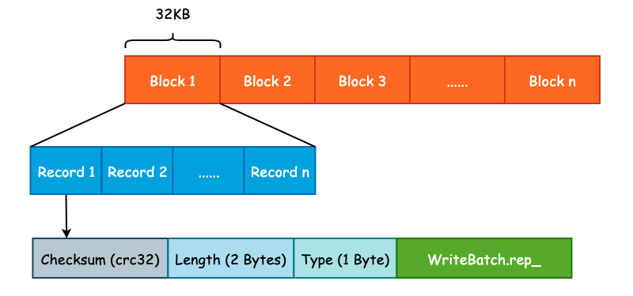
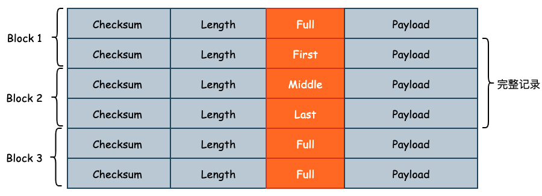

# WAL

对于存储引擎来说，为了能够加快写入速度，通常会将数据写入至位于内存的缓冲区中，然后由后台线程或者是其它方式再持久化至底层硬盘中。但是这样一来会有数据丢失的风险，因为内存中的数据是易失的。因此绝大多数存储引擎都是采用 WAL (Write Ahead Log) 的方式，首先将数据顺序地写入预写日志文件中，再去处理核心写入逻辑，以防止数据在节点宕机时的丢失。

InnoDB 存储的 redo log 就是一种典型的 WAL 实现，由于预写日志不可能任其无限增长，所以 InnoDB 使用了“环形数组”的方式进行覆盖写入，单个 redo log 的默认大小为 48MB。leveldb 并没有采用循环写入的方式实现，而是使用创建新的日志文件并删除旧有的日志文件实现。

LSM 树为了优化读取性能，将预写日志文件切割成了大小为 32KB 的连续 Block，并且每一个预写日志的大小为 2MB，和 MemTable 的默认大小保持一致。每一个 Block 中会包含多个连续的日志记录，每一个日志记录除了 User Key 和 User Value 以外，还会包括校验和（checksum）、长度以及记录类型等信息。预写日志格式如下图所示:

